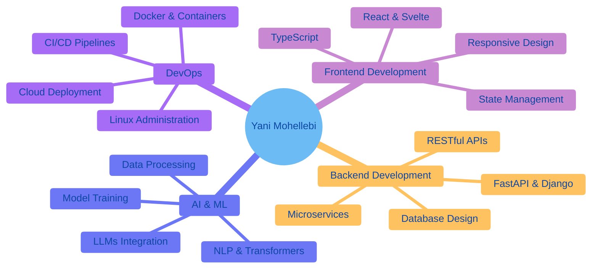

<div align="center">

# 👋 Hey, I'm **Yani Mohellebi**


**🚀 Crafting intelligent systems that think, learn, and act**

[](https://www.yanimohellebi.tech)
[](https://linkedin.com/in/yanimohellebi)
[](mailto:yani.mohellebi@example.com)

</div>

---

## 🧠 **About Me**

```python
class Developer:
    def __init__(self):
        self.name = "Yani Mohellebi"
        self.role = "Full-Stack Developer & AI Engineer"
        self.location = "Dijon, France 🇫🇷"
        self.passions = ["AI Systems", "Intelligent Bots", "Scalable Architecture"]
        self.current_focus = ["NLP", "Machine Learning", "LLM Integration"]
    
    def get_stack(self):
        return {
            "backend": ["Python", "FastAPI", "Django", "Node.js"],
            "frontend": ["React", "Svelte", "TypeScript", "TailwindCSS"],
            "ai_ml": ["PyTorch", "Transformers", "LangChain", "OpenAI API"],
            "databases": ["PostgreSQL", "MongoDB", "Redis"],
            "tools": ["Docker", "Git", "Linux", "CI/CD"]
        }
```

---

## 🛠️ **Tech Stack**

<div align="center">

### **Languages**


### **Frameworks & Libraries**


### **AI/ML & Data**


### **DevOps & Tools**


</div>

---

## 🎯 **What I'm Currently Working On**

<table>
<tr>
<td width="50%">

### 🤖 **AI & Machine Learning**
- Building intelligent chatbots with **LangChain**
- Fine-tuning LLMs for specialized tasks
- Implementing RAG systems for knowledge retrieval
- Exploring multimodal AI applications

</td>
<td width="50%">

### 💻 **Full-Stack Development**
- Architecting scalable APIs with **FastAPI**
- Creating reactive UIs with **React/Svelte**
- Designing efficient database schemas
- Implementing real-time features with WebSockets

</td>
</tr>
</table>

---

## 🏆 **Expertise & Capabilities**



---

## 🌟 **Core Competencies**

<div align="center">

| 🎨 **Frontend** | ⚙️ **Backend** | 🤖 **AI/ML** | 🔧 **DevOps** |
|:---:|:---:|:---:|:---:|
| Modern UI/UX | API Architecture | NLP Systems | Container Orchestration |
| Component Design | Database Optimization | Model Integration | CI/CD Automation |
| State Management | Authentication & Security | Data Pipelines | Cloud Infrastructure |
| Performance Tuning | Scalable Systems | ML Deployment | Monitoring & Logging |

</div>

---

## 💡 **Innovation Areas**

<div align="center">

```ascii
╔══════════════════════════════════════════════════════════════╗
║                                                              ║
║   🧠 Natural Language Processing  →  Building conversational AI     ║
║   🔮 LLM Applications            →  Integrating GPT & Claude  ║
║   🌐 Full-Stack Architecture     →  End-to-end solutions      ║
║   📊 Data-Driven Systems         →  Analytics & Insights      ║
║   🚀 Performance Optimization    →  Speed & Scalability       ║
║                                                              ║
╚══════════════════════════════════════════════════════════════╝
```

</div>

---

## 📚 **Knowledge Pipeline**

```python
learning_roadmap = {
    "mastered": [
        "Python ecosystem (FastAPI, Django, Pandas)",
        "React & modern frontend frameworks",
        "SQL & NoSQL databases",
        "Docker & containerization"
    ],
    "advancing": [
        "Advanced NLP & transformer models",
        "MLOps & model deployment strategies",
        "System design & architecture patterns",
        "Cloud-native development (AWS/GCP)"
    ],
    "exploring": [
        "Rust for high-performance systems",
        "WebAssembly for browser-based ML",
        "Edge computing & IoT integration",
        "Quantum computing fundamentals"
    ]
}
```

---

## 🎓 **Development Philosophy**

<div align="center">

> **"Write code that speaks for itself, build systems that scale effortlessly, and create AI that augments human potential."**

</div>

<table>
<tr>
<td align="center" width="33%">
<br/>
<b>Clean Code</b><br/>
<sub>Readable, maintainable, testable</sub>
</td>
<td align="center" width="33%">
<br/>
<b>AI-First</b><br/>
<sub>Intelligent, adaptive, learning</sub>
</td>
<td align="center" width="33%">
<br/>
<b>Performance</b><br/>
<sub>Fast, efficient, scalable</sub>
</td>
</tr>
</table>

---

## 📫 **Let's Connect**

<div align="center">

I'm always open to collaborating on innovative projects, discussing AI/ML, or just having a tech chat!

[](https://www.yanimohellebi.tech)
[](https://linkedin.com/in/yanimohellebi)
[](mailto:your.email@example.com)

</div>

---

<div align="center">

### **💻 "Code is poetry, AI is the future"**


</div>
